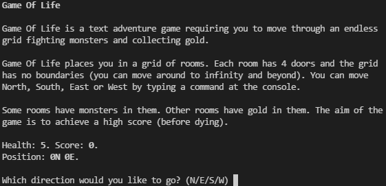

Console Game
============

Cloning
-------

    $ git clone https://github.com/j-/console-game.git && cd console-game

Installing
----------

    $ npm install

Testing
-------

    $ npm test
    $ npm test -- --watch # Run tests in watch mode

Building
--------

    $ npm run build

Build output will go to `dist/`.

Running
-------

    $ API_HOST=http://yourstubserver:8080/ npm start

Set the `API_HOST` environment variable to configure the game server host name.
By default the game will try to connect to `http://localhost:8080`.

Assumptions
-----------

This game was designed with some assumptions in mind.

**Room contents may change over time**

* The pattern of gold and monsters cannot be predicted
* An API request to the game engine must be made for each room
* The same room's contents may change over time
* Every time a room is entered, its contents are queried again
* Entering the same room twice will result in two API calls

**The transition between rooms is what triggers game logic**

* The first room is empty when the game starts
* Only when the player moves to another room is their health/score affected
* Entering (0, 0) after the game has started will have an effect
